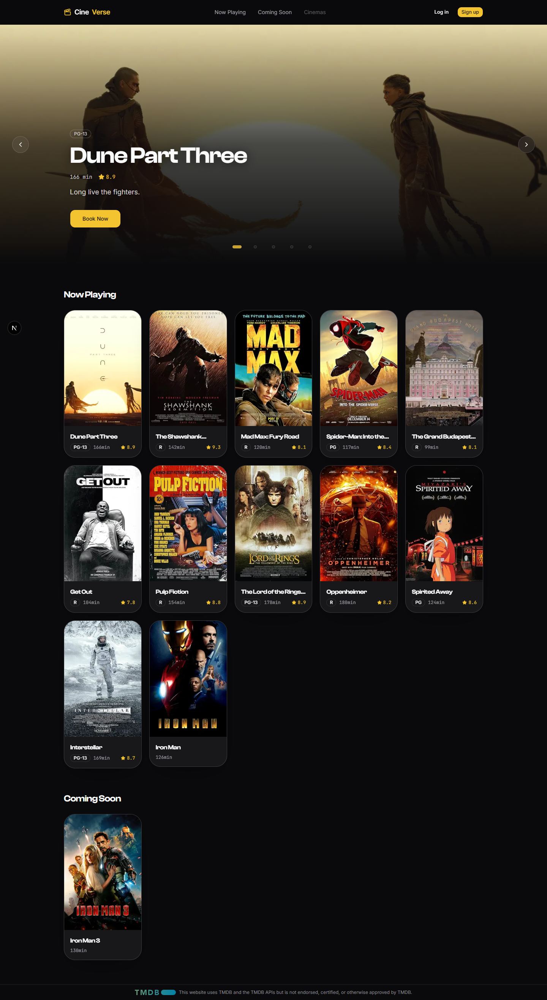
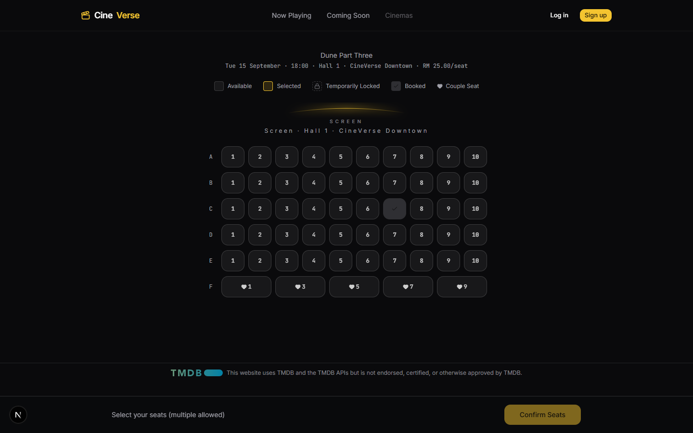
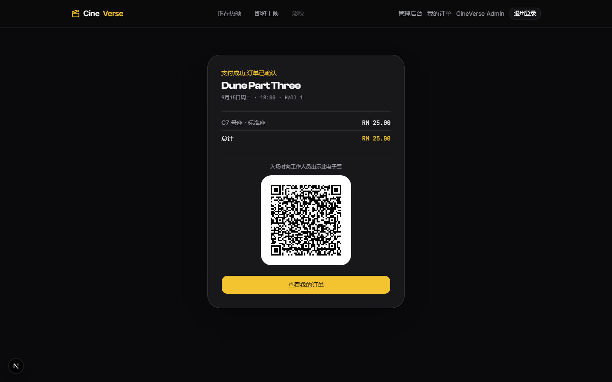
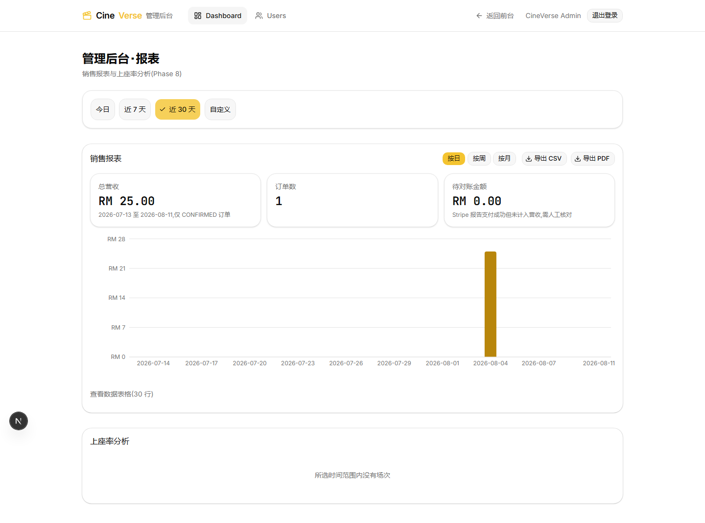

# CineVerse — Online Cinema Seat Booking System

[](https://github.com/scsccso/cineverse/actions/workflows/ci.yml)


An online cinema seat booking system: browse now-playing/coming-soon movies →
pick a showtime → select seats in real time on a live seat map → pay with
Stripe → get a QR-code e-ticket the moment payment succeeds. Admins can manage
movies, showtimes, and user accounts, and view sales/occupancy reports.
Cinema/hall data is fully modeled in the backend, but there is currently no
admin UI for it — the layout was intentionally frozen at MVP scope (see Phase
3 in `CLAUDE.md`). Frontend and backend are fully decoupled (Next.js + Spring
Boot), backed by PostgreSQL, with Redis handling seat-selection concurrency
locking.

**This is a job-search portfolio project.** The goal is to demonstrate
full-stack engineering ability — concurrency handling, payment idempotency,
security, testing, CI — not to be another CRUD exercise.

---

## Screenshots

| Homepage | Seat Selection |
|---|---|
|  |  |

| Payment Confirmed · E-Ticket | Admin · Reports |
|---|---|
|  |  |

All screenshots above are taken from the app actually running locally with
seed data — not design mockups or placeholders.

**There is no hosted live demo at the moment.** Running it locally is
currently the only way to try it — whether to deploy a cloud demo is still an
open decision (see Section 4 in `CLAUDE.md`); no link is faked here.

---

## Core Features

- **Real-time seat locking** — while a seat is being held during checkout, it
  shows as "locked" to other users in real time, preventing two people from
  booking the same seat at once.
- **A complete, working online payment loop** — integrated with Stripe
  Checkout: select seats → create booking → redirect to payment → webhook
  confirms the result. A payment flow that actually goes end-to-end, not one
  that stops at "simulate success."
- **E-tickets with check-in redemption** — a signed QR-code e-ticket is issued
  the moment payment succeeds, scannable at the door; redeeming the same
  ticket twice is rejected.
- **Admin reporting dashboard** — sales reports (daily/weekly/monthly) and
  occupancy analysis, with CSV/PDF export.
- **Liquid Glass visual design** — glassmorphic cards with a pointer-following
  highlight, paired with smooth page transitions and micro-interactions.

---

## Technical Highlights (for readers who want to dig in)

Each item below is not just a list of buzzwords — it explains what problem
the design actually solves:

- **Redis distributed lock for seat-selection concurrency** — locking is done
  with a single `SET key value NX EX ttl` command, not a "GET then SET"
  two-step check, which eliminates the race window where two concurrent
  requests both read "unlocked" and both proceed to SET. Redis isn't
  configured for persistence, so the database still carries a pre-check as a
  fallback source of truth — but the concurrency problem is actually solved
  by Redis's atomic lock: if locking any one seat in the request fails, every
  lock already acquired in that request is released, and a 409 is returned
  naming exactly which seat conflicted. A real concurrency integration test
  fires two threads at the same seat simultaneously and asserts that exactly
  one succeeds, one fails, and the failed attempt leaves zero residue in the
  database.
- **Stripe webhook idempotency + the `ORPHANED_SUCCESS` edge case** — the
  idempotency key is a unique constraint on `payments.stripe_session_id`, but
  what actually closes the race is a `SELECT ... FOR UPDATE` row lock, not a
  "check then act" pattern. A more interesting edge case: what if the seat
  hold window (5 minutes) expires and releases the seat, and *then* the
  Stripe payment succeeds, arriving late? By that point the seat may already
  be booked by someone else — the order can't be blindly flipped back to
  "confirmed." This case is marked `ORPHANED_SUCCESS` (the money was
  genuinely received, but it isn't auto-linked to a booking and isn't
  auto-refunded). It's recorded, not silently auto-resolved with a risky
  decision — refunds for this state go through manual reconciliation.
- **JWT auth: in-memory access token + httpOnly refresh-token rotation** —
  the access token (15 min) lives only in front-end memory, never written to
  localStorage, reducing XSS exposure. The refresh token (7 days) is an
  httpOnly cookie; every `/refresh` call immediately marks the old token
  `revoked` in the database and issues a fresh pair — rotation, not a simple
  extension.
- **Admin reports run native SQL aggregation, not "pull the whole table and
  reduce it in application memory"** — `GROUP BY` + `date_trunc` +
  `generate_series` for zero-filled buckets, computed directly in Postgres.

---

## Tech Stack

| Layer | Choice |
|---|---|
| Backend | Java 21 LTS, Spring Boot 3.5.15 |
| Frontend | Next.js 16 (App Router + Turbopack), React 19.2, TypeScript |
| Database | PostgreSQL 16 |
| Cache / Locking | Redis 7 |
| Payments | Stripe Checkout |
| Movie Metadata | TMDB API, OMDb API |
| CI | GitHub Actions (Maven build + test, `npm run build`/`lint`) |

---

## Architecture Principles

- Layered: Controller → Service → Repository — Controllers never touch
  Repositories directly.
- Entities and DTOs are strictly separated, mapped via MapStruct.
- Global exception handling: `@RestControllerAdvice` gives every error a
  consistent response shape (error code + message, no raw stack traces).
- Permission model: `ROLE_CUSTOMER` / `ROLE_ADMIN`, with room to add a
  cinema-manager role later if needed.
- **Public vs. authenticated routes are separated at the routing-design
  stage**: browsing movies and showtimes is a public, read-only API and
  should never depend on being logged in.
- Every module ships with: API docs (Swagger), unit tests for at least the
  core logic, and a README update.
- **Any new/changed Flyway migration must be accompanied by an update to
  `docs/DATABASE.md`** before delivery — new tables' fields, keys, and
  foreign-key delete strategies, along with the relationship diagram and the
  Phase they were introduced in. This is a required step for every Phase,
  same as updating `CLAUDE.md`/`README.md` — the whole point of that file is
  to avoid reconstructing the schema by re-reading raw migration files every
  time.

---

## Module Roadmap (Phase-Based, Iterative)

> Ordered by dependency relationships and marginal value to the portfolio.
> Promotions/loyalty points, reviews/ratings, and email/SMS notifications are
> low-value and live in the backlog — not built for the MVP.

- **Phase 0** — Project scaffolding (Docker Compose, Flyway, global error
  handling, CI, Swagger) — ✅ complete
- **Phase 1** — User management (JWT auth, token rotation, CORS) — ✅
  complete
- **Phase 2** — Movie management (CRUD, genres, trailers, ratings, poster
  storage) — ✅ complete
- **Phase 3** — Cinema/hall/seat management (seat layout generation, 2 seat
  types) — ✅ complete
- **Phase 4** — Showtime scheduling (conflict checking with a 20-minute
  turnaround buffer) — ✅ complete
- **Phase 5** — Seat selection & booking (Redis distributed locking, polling)
  — ✅ complete
- **Phase 6** — Payments (Stripe Checkout, webhook idempotency,
  `ORPHANED_SUCCESS` handling) — ✅ complete
- **Phase 7** — Orders & e-tickets (signed QR tickets, redemption) — ✅
  complete
- **Phase 8** — Admin dashboard & reporting (sales/occupancy reports,
  CSV/PDF export) — ✅ complete

The Phase-based roadmap above concluded with Phase 8. Admin UIs for user
management, movie management, and showtime scheduling shipped afterward as
separate, dated iterative deliveries (2026-08-11 through 2026-08-14) rather
than as part of Phase 8 itself — see the corresponding dated entries in
[`CLAUDE.md`](./CLAUDE.md) for each.

Full architectural decisions and rationale for each Phase live in
[`CLAUDE.md`](./CLAUDE.md); superseded/historical decision narratives live in
[`docs/DECISIONS.md`](./docs/DECISIONS.md).

---

## Known Trade-offs & Limitations

- **Tech stack settled on Java 21 LTS + Spring Boot 3.5.15, not the project's
  original Java 25 + Spring Boot 4.1.** This was a hiring-market alignment
  call, not a technical shortcoming — in the current hiring market, "Java
  LTS" and "Spring Boot 3" still default to these versions, not a
  recently-released major line whose ecosystem and tutorials are still
  catching up. The cost: Spring Boot 3.5 hit OSS EOL on 2026-06-30 (the last
  minor release in the 3.x line — there's no "newer but still-maintained"
  3.x to move to instead). Chosen deliberately, not overlooked: a portfolio
  project doesn't need an ongoing security-patch supply, and what an
  interviewer is actually gauging is familiarity with the Spring Boot 3.x
  ecosystem, not whether this specific deployment can receive a patch today.
  Full research and trade-off record in
  [`docs/DECISIONS.md`](./docs/DECISIONS.md).
- **Cinema/hall management has no admin UI.** The backend supports creating
  cinemas and halls (with automatic seat generation), but there's
  intentionally no update/delete API — Phase 3 froze this as a fixed MVP
  scope (1 cinema, 3 halls). Changing a layout means deleting and recreating
  the hall.
- **Malaysian LPF content ratings aren't mapped** — `content_rating` currently
  stores MPAA-style values (e.g., "PG-13") sourced from OMDb/TMDB, not the
  local LPF classification system. This is a known, deliberately deferred
  gap.
- **Mobile WebP image sharpness** — images can appear slightly under-sampled
  on high-DPR (Retina-class) mobile screens; the root cause has been
  diagnosed in the image-optimization pipeline but not yet fixed.
- **No hosted demo yet** — see the note under Screenshots above.

---

## Project Structure

```
CineVerse/
├── CLAUDE.md                 # Project memory: architecture decisions, roadmap, currently active tech choices
├── docs/DECISIONS.md         # Decision log: full write-ups trimmed out of CLAUDE.md, debugging narratives, superseded decisions
├── docs/DEVELOPMENT.md       # Developer reference: API curl examples, environment setup, manual verification steps
├── docs/DATABASE.md          # Database schema reference: table structure, foreign-key strategy, field-level notes
├── docker-compose.yml        # Local dependencies: Postgres 16 + Redis 7
├── .env.example               # docker-compose variables + the Stripe key read directly by the backend process
├── cineverse-backend/        # Spring Boot backend (Maven project)
│   └── src/main/resources/db/migration/  # Flyway migration scripts
└── frontend/                 # Next.js frontend
    ├── .env.example           # NEXT_PUBLIC_API_BASE_URL example
    └── src/
        ├── app/
        │   ├── (customer)/    # Customer route group: /, /login, /register, /profile, /showtimes/[id](/seats), /bookings(/[id]/confirmed)
        │   └── admin/         # Admin backend (independent nav shell + role check): /admin/dashboard, /admin/movies(/new, /[id]/edit), /admin/showtimes(/new), /admin/users
        ├── components/        # ui (shadcn) / auth / layout / motion / booking / admin
        ├── lib/                # API client, auth context, zod schemas
        └── proxy.ts           # Route protection (Next 16: middleware renamed to proxy)
```

---

## Running Locally

Environment setup, common pitfalls, and step-by-step run instructions live in
[`docs/DEVELOPMENT.md`](./docs/DEVELOPMENT.md).

---

## Development Conventions

- **Branch naming**: `feature/user-management-login`, `fix/xxx`
- **Commit convention**: Conventional Commits (`feat:`, `fix:`, `test:`,
  `docs:`, `refactor:`)
- **On completing each Phase**: the intended convention (see `CLAUDE.md`) is
  to cut a tag per Phase (e.g. `v0.1-user-management`) — not yet applied in
  this repository's actual history; the commit log is the authoritative
  delivery timeline for now.

---

## Attribution

This website uses TMDB and the TMDB APIs but is not endorsed, certified, or
otherwise approved by TMDB. Movie metadata for legacy seed data is sourced
from OMDb under its non-commercial terms.
